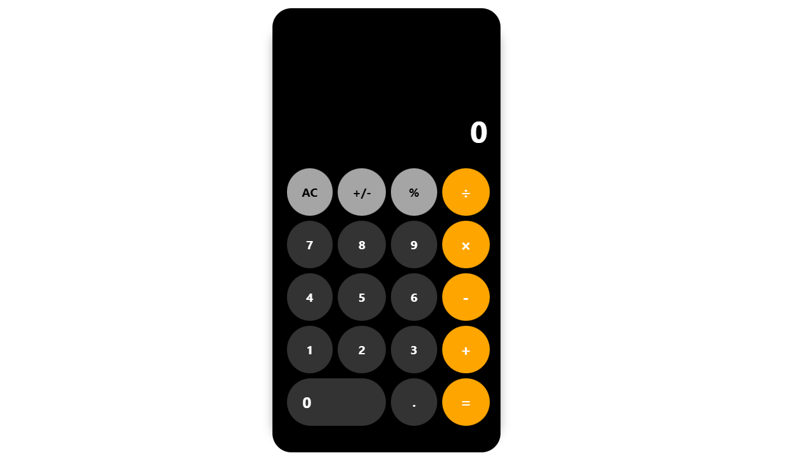

# Calculadora em React



Este projeto é uma **calculadora funcional** desenvolvida como parte de uma atividade proposta no curso **React + Angular**, patrocinado pela **Accenture** em parceria com a **Uninassau Boa Viagem**.

A aplicação foi desenvolvida com **React**, utilizando práticas modernas de desenvolvimento front-end, e possui as principais funcionalidades de uma calculadora básica, além de alguns recursos adicionais.

---

## 🔧 Funcionalidades

- **Operações básicas**: Adição, subtração, multiplicação e divisão.
- **Operações avançadas**:
  - Inverter sinal (+/-).
  - Porcentagem (%).
  - Limpar tudo (AC).
- **Tratamento de erros**: Exibe "Erro" em casos como divisão por zero.
- **Design responsivo e interativo**: Inspirado na calculadora do iPhone (iOS).

---

## 🛠️ Tecnologias utilizadas

- **React**: Biblioteca principal para a criação da interface.
- **CSS**: Estilização customizada.
- **JavaScript**: Lógica das funcionalidades.

---


## 🚀 Como executar o projeto

1. **Clone este repositório**:
   ```bash
   git clone https://github.com/seu-usuario/calculadora-react.git
   cd calculadora-react


